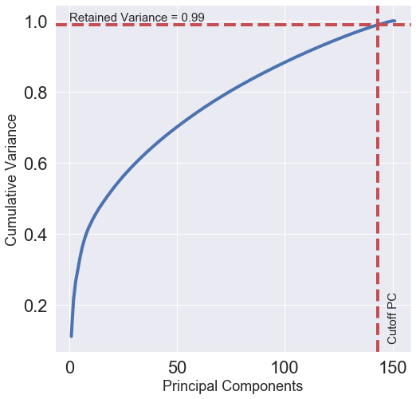
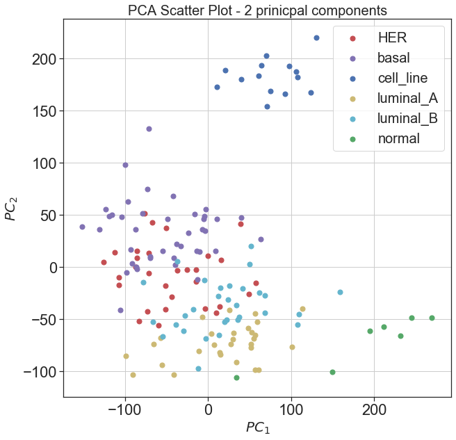
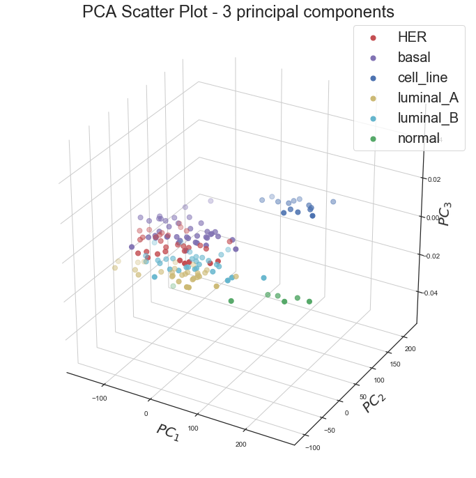
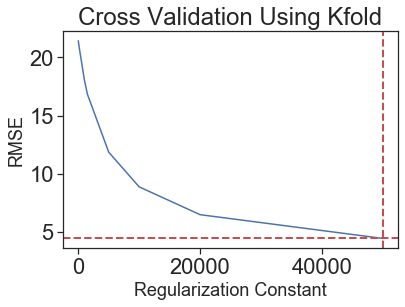
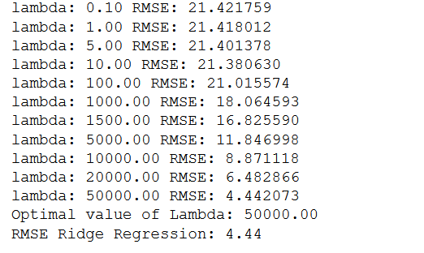

# Curse of Dimensionality through Random Lasso Regression
### Bilal Mufti, Hira Anis, James Mathhew Hamilton, Noor-us-Saba Khan, Shakir Shakoor Khatti
# 1. Introduction
# 2. Problem Statement
In real world scenarios, especially in the field of bioinformatics and genomics, we frequently encounter datasets with a lot more features than samples such that the ratio of features to data points is in the order of 500. In such situations, the traditional regression techniques fail to produce beneficial results exhibiting decreasing accuracy with increasing features to datapoint ratio. This shortcoming of regression models leads to research constraints in this and other concerned fields. 
# 3. Data Set & Basic Idea
 The Dataset GSE45827 on breast cancer gene expression from CuMiDa is taken from Kaggle. The dataset is available here ([link](https://www.kaggle.com/brunogrisci/breast-cancer-gene-expression-cumida)). Kaggle is an online community of data scientists and machine learning practitioners and offering public datasets for algorithm testing. 
The dataset comprises of 151 samples and gene expression data values for 54676 genes . There are six classes of sample types namely,'HER' , 'basal', 'cell_line', 'luminal_A', 'luminal_B' and 'normal'.
## Data Pre-Processing and formatting
We downloaded a csv file containing 152 rows and 54677 columns, available on the link mentioned earlier.   
  The first column is a sample identification number (samples), and the second is the sample type (type). We loaded the "type" column as a dataframe and used that for color coding and visualization of the PCA plots later. We used the header for gene ids as identification marker to form an array for processing. We used this array to check for 'Nan' or missing values and after confirming that there are none, we proceed to use it as our processing dataset. 
# 4. Unsupervised Machine Learning
## Principal Component Analysis
When it comes to the dimensionality reduction, Principal Component Analysis (PCA), which comes under the unsupervised learning techniques of Machine Learning (ML) is primarily used for the visualization of the high-dimensional data in the new set of coordinates defined using PCA. Here we use PCA in scikit-learn decomposition module.  PCA aids in the dimensionality reduction by orthogonally projecting the data onto lower-dimension linear space by maximizing the variance of projected data and minimizing the mean squared distance between projection and data points.  
  In this application, PCA is applied on the pre-processed data set to visualize the data in newly defined principal components. In this project, the data is visualized in both 2D and 3D using the first two principal components and first three principal components respectively. Cumulative variance for the principal components is plotted against the number of principal components to analyze the number of principal components needed to achieve the required variance.
## Results for Unsupervised Learning Model
### Cumulative Variance
PCA can be used to describe how many components can be used to describe the data completely. We  will determine this by looking at the cumulative explained variance ratio as a function of the number of components.  
||
|:--:|
|*Fig 1. Cumulative variance plotted against number of principal components*|

This curve shows much of the total variance is contained within the first 'n' PCA components. We can see that our first 30 PCA components contain approximately 60% of the variance. We are interested in the number of components that retain approximately 99% of variance. From the above graph we can see that 99% of variance is contained in the first 143 components. The remaining components contain information that is mostly redundant and is not useful in describing the data labels. 

### 2D Principal Component Data Visualization 
As it can be seen in the presented results for the cumulative variance retained by the number of principal components that first two principal components retain greater amount of variance compared to the rest of principal components, therefore, we have plotted the data using the original labels in the space of first two principal components 
||
|:--:|
|*Fig 2. 2D visualization of data using first two principal components*|

### 3D Principal Component Data Visualization 
Similarly, we have plotted the data using the original labels in the space of first three principal components 
||
|:--:|
|*Fig 3. 3D visualization of data using first three principal components*|

### Regression Analysis with and without PCA
In this section, we will see that how PCA can be used to improve the prediction through regression analysis. Linear and ridge regression were applied on dimensionally reduced data, obtained through PCA. The orignal dataset had 54765 features which were reduced down to 151.  

After application of PCA, a new dataset with 151 principal components was achieved. The original dataset had categorical labels having 6 different categories, however it is not possible to use categorical data directly for regression and hence label encoding was used to assign numeric values to the labels. This new dataset and transformed labels were then divided in to training and testing data using 80-20 division rule. 

Initially, the model was trained using linear regression and then the test data was used to find the predicted labels and rmse came out to be 10.246 as shown below from output.  
RMSE Linear Regression: 10.246049817401543  

Next, ridge regression was used for training and testing. Since ridge regression is a type of regression technique that uses regularization constant (lambda) for weights prediction therefore it was required to find a lambda value that could minimize the error. For this purpose a 10-fold cross validation was carried out, and from the figure below it can be seen that the optimal value turned out to be 50000.  

| | |
|:--:|:--:|
|*Fig 4. 10-fold cross validation*| Sample |

After doing unsupervised learning analysis using PCA, it was observed from the RMSE values obtained with and without PCA that PCA is not the most accurate technique to handle the dataset with D>>>N. Therefore it was required to come up with a novel algorithm that can potently handle the data with very large number of features compared to samples. An algorithm for random lasso regression was written to cater this problem which will be discussed in detail under supervised learning part of the project.(Moreover it was also learned that linear and ridge regression are not very suitable for categorical dataset)
# 5. Supervised Machine Learning
# 6. Model Evaluation
