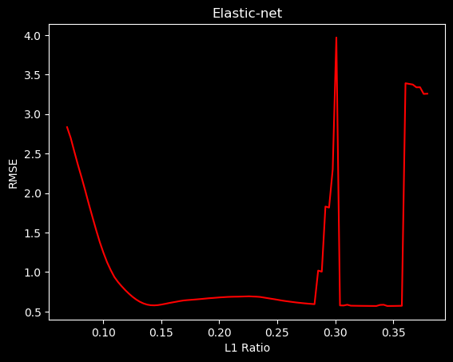
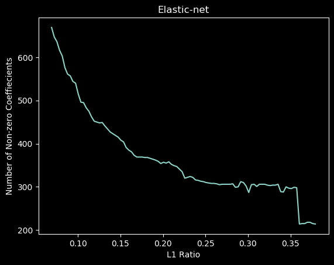
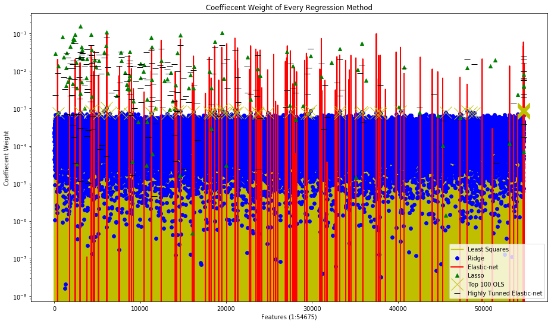
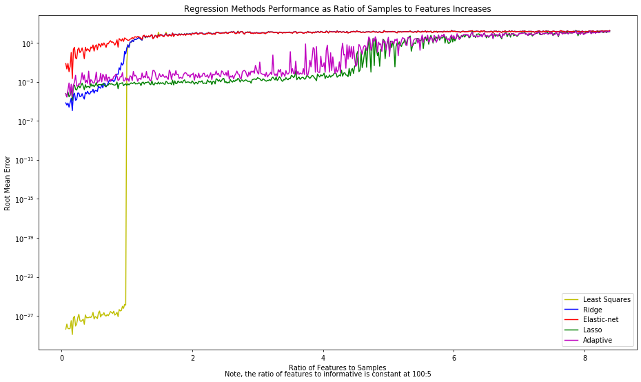
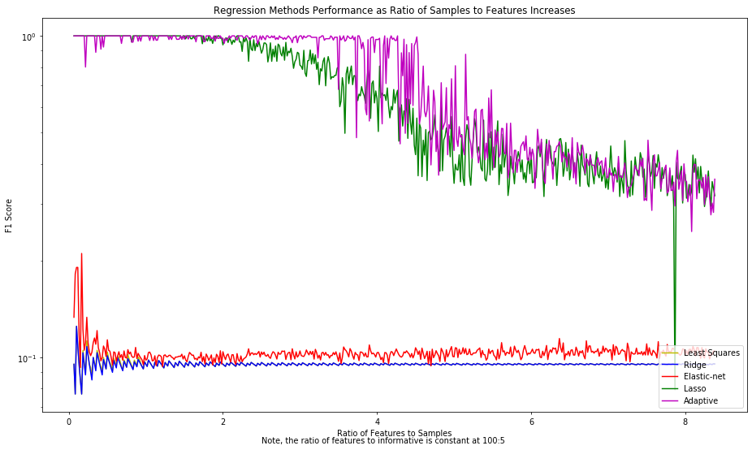
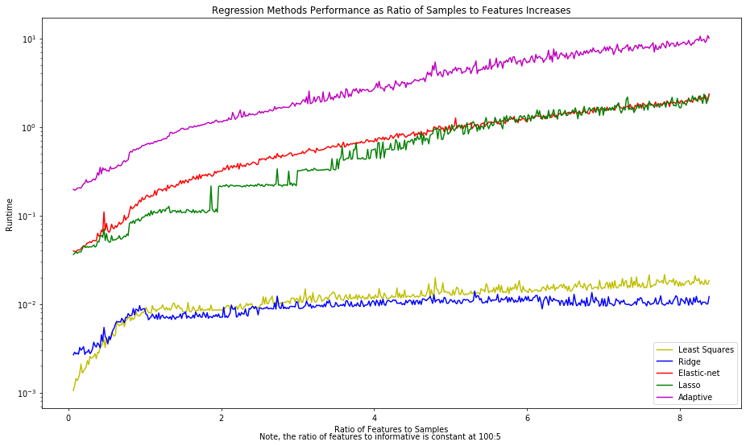
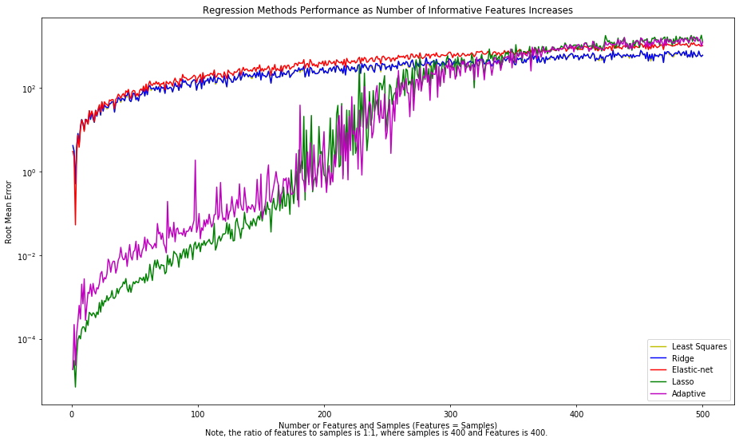
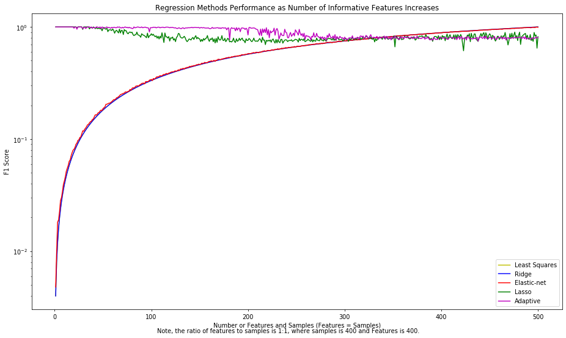
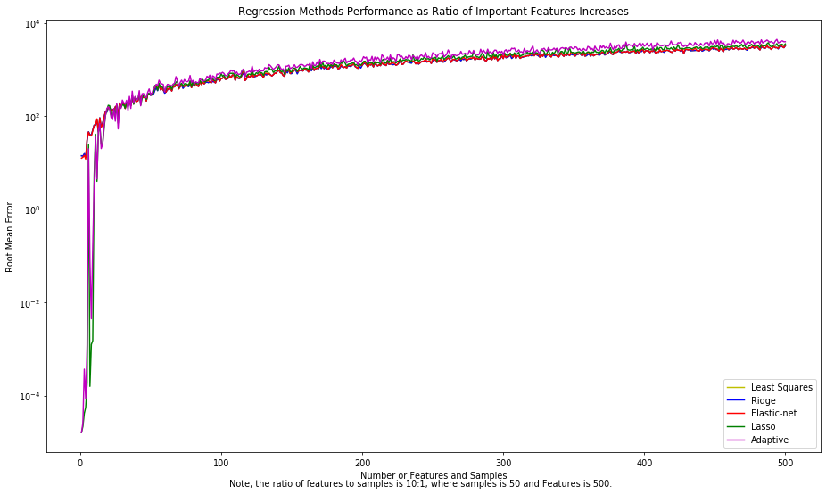
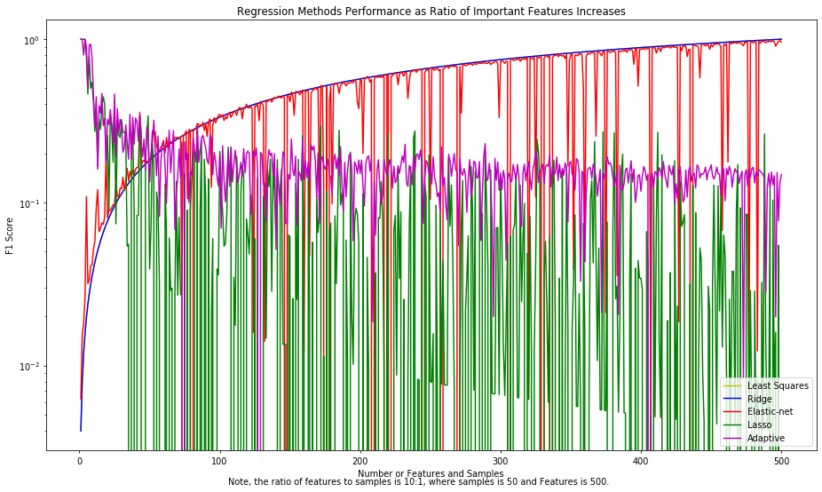

# Handling the Curse of Dimensionality through Random Lasso Regression
### Bilal Mufti, Hira Anis, James Matthew Hamilton, Noor-us-Saba Khan, Shakir Shakoor Khatti

# 1. Problem Statement
In real world scenarios, especially in the field of bioinformatics and genomics, we frequently encounter datasets with a lot more features than samples such that the ratio of features to data points is in the order of 500. In such situations, the traditional machine learning techniques fail to produce beneficial results exhibiting decreasing accuracy with increasing features to datapoint ratio. This shortcoming of models leads to research constraints in concerned fields. 
# 2. Introduction
In this project a data set with higher number of features and fewer samples is chosen to test dimensionality reduction algorithms both using unsupervised and supervised learning techniques. Principal component analysis is used in the unsupervised models to perform the dimensionality reduction and different regression techniques are employed in supervised learning to compare the results and effectiveness of each regression technique in reducing the number of features.    
# 3. Data Set & Basic Idea
The Dataset GSE45827 on breast cancer gene expression from CuMiDa is taken from Kaggle. The dataset is available here ([link](https://www.kaggle.com/brunogrisci/breast-cancer-gene-expression-cumida)). Kaggle is an online community of data scientists and machine learning practitioners and offering public datasets for algorithm testing. 
The dataset comprises of 151 samples and gene expression data values for 54676 genes . There are six classes of sample types namely, 'HER' , 'basal', 'cell_line', 'luminal_A', 'luminal_B' and 'normal'.
## Data Pre-Processing and formatting
We downloaded a CSV file containing 152 rows and 54677 columns, available on the link mentioned earlier.   
  The first column is a sample identification number (samples), and the second is the sample type (type). We loaded the "type" column as a dataframe and used that for color coding and visualization of the PCA plots later. We used the header for gene ids as identification marker to form an array for processing. We used this array to check for 'Nan' or missing values and after confirming that there are none, we proceed to use it as our processing dataset. 
# 4. Unsupervised Machine Learning
## Principal Component Analysis
When it comes to the dimensionality reduction, Principal Component Analysis (PCA), which comes under the unsupervised learning techniques of Machine Learning (ML) is primarily used for the visualization of the high-dimensional data in the new set of coordinates defined using PCA. Here we use PCA in scikit-learn decomposition module.  PCA aids in the dimensionality reduction by orthogonally projecting the data onto lower-dimension linear space while maximizing the variance of projected data and minimizing the mean squared distance between projection and data points. In this application, PCA is applied on the pre-processed data set to visualize the data in newly defined principal components.
## Results for Unsupervised Learning Model
### Cumulative Variance
PCA can be used to describe how many dimensions can be used to describe the data completely. We  will determine this by looking at the cumulative explained variance ratio as a function of the number of components. 

||
|:--:|
|*Fig 1. Cumulative variance plotted against number of principal components*|

This curve shows much of the total variance is contained within the first 'n' PCA components. We can see that our first 30 PCA components contain approximately 60% of the variance. We are interested in the number of components that retain approximately 99% of variance. From the above graph we can see that 99% of variance is contained in the first 143 components. The remaining components contain information that is mostly redundant or is already contained in selected features hence not useful in describing the data labels. 

### 2D Principal Component Data Visualization 
As it can be seen in the presented results for the cumulative variance retained by the number of principal components that first two principal components retain greater amount of variance compared to the rest of principal components, therefore, we have plotted the data using the original labels in the space defined by first two principal components  and 

||
|:--:|
|*Fig 2. 2D visualization of data using first two principal components*|

### 3D Principal Component Data Visualization 
Similarly, we have plotted the data using the original labels in the space of first three principal components , , and 

||
|:--:|
|*Fig 3. 3D visualization of data using first three principal components*|


## Regression Analysis with PCA
In this section, we will see that how PCA can be used to improve the prediction through regression analysis. Linear, ridge and Lasso regression were applied on dimensionally reduced data, obtained through PCA. After application of PCA, a new dataset with reduced dimensions was achieved. The original dataset had categorical labels having 6 different categories, however it is not possible to use categorical data directly for regression and hence label encoding was used to assign numeric values to the labels. This new dataset and transformed labels were firstly divided in to training and testing data using 80-20 division rule such that the training data contains the first 80% of the labels. For this case, the RMSE value obtained for each class of regression was pretty high and on analysis it was revealed that data on which the testing was done had labels on which data was not trained. It showed us that in cases where the data labels are more sequential such that one category of label is clustered in the beginning and the other in the end, the data should not be split sequentially, no matter the ratio. To overcome this issue, we decided on splitting the data in to training and testing sets randomly using scikit command. As exepected, the RMSE values improved with this approach.

### Linear Regression
Initially, the model was trained using linear regression and then the test data was used to find the predicted labels and rmse came out to be 10.246 as shown below from output.  
RMSE Linear Regression: 10.246049817401543  

### Ridge Regression
Ridge regression was then used for training and testing. Since ridge regression is a type of regression technique that uses regularization constant (λ) for weights prediction therefore it was required to find a lambda value that could minimize the error. For this purpose a 10-fold cross validation was carried out, as shown in the figure below. 

| | |
|:--:|:--:|
|*Fig 4. 10-fold cross validation*|*Fig 5. Optimal value for λ*|

### Lasso Regression
When Lasso Regression was carried out on the pca applied dataset, expectedly the results improved as shown below in the RMSE value. Also, 10-fold cross validation was carried out to determine the optimal value of regularization parameter (λ)

RMSE Lasso Regression: 2.4187641419349832  
Best λ: 50

After doing unsupervised learning analysis using PCA, it was observed from the RMSE values obtained after applying regression techniques on dimensionally reduced data that PCA is not the most accurate technique to handle the dataset with D > > > >N. . For furthur analysis on this issue, supervised learning algorithms will be applied for both dimensionality reduction and label prediction. Least square, Ridge, Elastic Net, Lasso, Adaptive Lasso and a novel "Random Lasso" techniques would be used and results will be discussed to compare unsupervised and supervised machine learning performance.


# 5. Supervised Machine Learning
Supervised learning looks at both an independent (X) and dependent (y) variable, where we attempt to build some model using the given data in X to predict the values in y. Unsupervised learning only looks at and independent variable (X) and seeks to derive some meaning from this dataset alone. We will limit our focus to the subset of supervised learning known as **regression analysis** here.

* The **independent variable** is an NxD matrix, where N is the samples and D is the features.

* The **dependent variable**  is a vector of length N, where N is once again the samples.

### High Dimensional Data | Intuitively Explained

Regression analysis tends to work best when there are more samples than features. **High Dimensional Data** is the term we use then features exceeds samples. The performance of regression techniques will continue to degrade as the ratio of features to samples increases. **This makes some sense intuitively, as N _(samples)_ should really be thought of as our "data", and D _(features)_ is actually something we are trying to predict to ultimately predict y.** The more data we have, the easier it is to make discover how each D predicts y. The larger D is the more features we have to examine, and use to predict y.

Alas, it does not benefit us to look at more features, despite the impression that more-data-is-better. In fact, we would like to examine is little features as possible. So if someone were to tell you:

>"I have a ton of data to look at, we can get some great results. The csv is 13,033,599 by 88!" You should respond, "Is this 13 million features?", to which a "yes" would warrant the conclusion, "We have no data." - A Story of the Curse of Dimensionality

#### Bad:

<p style="text-align: center;">Features >> Samples</p>  
<p style="text-align: center;">D >> N</p>  

But at what point does it the ratio of features to samples become so high that we cannot derive meaning? We analysis this here, but first we must discuss...

### Dimension Reduction

Some of the features in a dataset may not be meaningful in anyway. Our goal is to eliminate these. By reducing the number of features we will essentially have more data; as discussed above. We discussed PCA, which uses a slightly different flavor or a goal. Indeed PCA reduces dimensionally, but **PCA is does not even look at the response variable y**. In general PCA will not help any model perform better in terms of accuracy, and we saw this above. This is because PCA treats the features with low variance as unimportant, and the features with high variance as important. It can be such that these high variance features have nothing to do with the response variable. It can be such that these low variance features have something to do with the response variable.**Alas, we can use regression for dimension reduction, which will take into consideration the response variable!**

The whole point of regression is to predict a coefficient for each feature, which can be used as a model, a formula, to predict y. There are a handful of beautiful regression techniques that researchers have at their disposal:

#### 1. **Ordinary Least Squares → No 0's**
  - Creates the most optimal line of best fit.
  - All coefficients predicted are non-zero.
  - I will show you results later that show the below *'advanced'* regression methods outperforming Ordinary Least Squares. Counterintuitively, this is actually the best regression method. No other regression method can ever be able to hope to outperform this. If you understand this you truly understand regression.

#### 2. **Ridge Regression → No 0's**
  - Similar to Ordinary Least Squares, but introduces a tunable variable λ that improves accuracy in exchange for a small amount for bias.
  - As we increase bias we  decrease variance. There is a tradeoff.

#### 3. **Lasso → Many 0's**
  - Similar to Ridge Regression in that there is a tunable variable λ.
  -The difference is that Lasso shrink coefficients that have little to do with the response variable down to 0. _(Is this what we are looking for?)_

#### 4. **Elastic-Net → Some 0's**
  - This is a hybrid between Ridge Regression and Lasso. So why didn't I put it in the middle of Ridge Regression and Lasso? Chronologically, it was invented later and uses both ridge and lasso.
  - It even has two λ's, which is pretty neat. If either λ_1 or λ_2  are zero, then the Elastic-Net would become either Lasso or Ridge Regression.

#### 5. **Adaptive Lasso & Random Lasso → Slightly More 0's than Lasso**
  - These are what we researched. More on them later.
  
We attempted to reduce the dimensionality of an extremely high dimensional dataset via PCA – now it's regressions turn.
<pre>
Has Null: False
Dim of Whole Dataset: (151, 54677)
Dims of X: (151, 54675)
Dims of y: (151,)
</pre>

This dataset had 362 times as many features as samples. When dealing with high-dimensional data Lasso flavored algorithms are out friend. It is unlikely that all 54677 of these features contribute to the response variable in some way. It would be helpful to reduce many of the coefficients that have no effect on the response variable to zero. Lasso does just that!

Our simulated data showed that performance of even lasso begins to decline once features exceed four times the number of samples. However, I believe this depends on a lot of things like the covariance and number of important features in a dataset. 

**RMSE of Various Regression Methods:**
<pre>
Least Squares RMSE: 1.6305999856398685
Ridge RMSE: 1.6305999856398685
Elastic RMSE: 3.503569676558001
Lasso RMSE: 1.1305735649223199
Adaptive RMSE: 3.0044117670893855
Guess Mean RMSE: 1.950980339219909
</pre>

In a somewhat immature way – we fire every regression methods we've got at this dataset. What was most critical to us is that the RMSE of a regression method is less than a naive guess of the mean of y. If out a regression methods RMSE is near or above a naive guess of the mean of y, then it is the case that a random toddler guessing would yield more meaningful results. We see that Lasso and Elastic-net show great promise, while OLS and Ridge are at-least reasonable.

**Number of Non-zero Coefficients:**
<pre>
Important Features Least Squares:   54675  
Important Features Ridge:           54675  
Important Features Elastic-net:     195  
Important Features Lasso:           253  
Important Features Adaptive Lasso:  0  
</pre>

What is important to us is the feature reduction. Below is a raw count of the non-zeros coefficients after running each regression method. So, these features can be thought of as important. We know that Ridge Regression and Least Squares will indeed not produce any zero'd coefficients, but we included these values to emphasize that point. Elastic-net and Adaptive Lasso are reasonably near the number of features to-which PCA reduced our dataset. It could also be the case that Lasso and Elastic-net, of a high L1 ratio, often reduce a the dataset to a near-square matrix. **We can not be certian, and it could very-well be the case that thousands of features are important!** This is why the simulated data regression research from before is of importance. However all these values seam quite reasonable.

We will ignore adaptive lasso for the rest of this analysis. However, if it were proved that adaptive lasso is superior for this favor of dataset, we would conclude that none of these features are important.

```python
print("Least Squares:  ", np.flip(np.argsort(np.abs(reg.coef_)))[0:10])
```

**Indices of Most Pronounces Features (Top 10):**
<pre>
Least Squares:   [ 6109 54671 54659 54624 54650 54623 54655 19489 21033 54670]
Ridge:           [ 6109 54671 54659 54624 54650 54623 54655 19489 21033 54670]
Elastic-net:     [ 6109 37495 37927 33641 21033 31091 14672 26977 12440 24248]
Lasso:           [ 1088  2994  6109 19489  1073  4294  2430 14672   963 11273]
Adaptive Lasso:  [54674 18232 18230 18229 18228 18227 18226 18225 18224 18223]
</pre>

Above are the indices of the coefficients furthest from zero for each regression method. This is how we can gauge importance. We are not simply looking at the feature with the highest coefficients. We are looking at the features with the highest absolute coefficients. A strongly negative coefficient is just as interesting as a strongly positive one.

We want to make sure that there is some agreement between the non-zero  coefficients of Elastic-net/Lasso and OLS/Ridge. We see such agreements, and are given some reassurances. For example, **feature 6109** is quite the popular kid.  If you look carefully feature 19489 is pretty popular as well. This is only the top 10 features, and more agreements can be seen further down, which is promising.

**Coefficients of Most Pronounces Features (Top 10):**
<pre>
Least Squares:   [0.00105738 0.0009885  0.00098678 0.00096564 0.00096194]
Ridge:           [0.00105738 0.0009885  0.00098678 0.00096564 0.00096194]
Elastic-net:     [ 0.10230358  0.09811327 -0.08494173 -0.07735693  0.07471841]
Lasso:           [-0.2157658   0.15476591  0.10656374  0.1061599  -0.09428705]
Adaptive Lasso:  [0. 0. 0. 0. 0.]
 </pre>

Looking at the actual coefficients of at the aforementioned indices yields nothing relevant to the task at hand – find important features. However, it does highlight that Elastic-net/Lasso will have higher coefficient values in general than OLS/Ridge. This is because Elastic-net/Lasso reduces many coefficients to zero. The  fallen coefficients forfeit their minuscule value to the non-zero coefficients. Since many coefficients reduced to zero for our dataset, there is a lot of bulk added to these non-zero coefficients.

||
|:--:|
|
|*Fig 5*|

It was difficult to put this much information into one plot. This is essentially the coefficients of each of the regression methods on a log scale. I cleverly chose symbols for each of these that would aid in analysis – though that is not apparent upfront.


* **Yellow Lines: Least Squares Coefficients.** These are underplayed behind Ridge Regression. They are usually the same coefficients as Ridge Regression, and can be assumed to they extend up to the blue circles. I would ignore the yellow, mores a proof of concept.

* **Blue Circles: Ridge Regression** As expected, ridge coefficients are generally lower than Elastic-net/Lasso. This is expected. We see see that some of the blue dots that are slightly higher vertically lie along a red line representing an important feature determined by Elastic-net. This shows agreement between Elastic-net and OLS/Ridge.

* **Red Line: Elastic-net.** We make Elastic-net a vertical line to gauge which of the other regression methods lie along this line. For example, it is often the case that a green triangle, representing an important feature determined by Lasso feature, lies along a red line.This shows agreement between Elastic-net and OLS/Ridge. These features are of high interested, especially when pared with a vertically high blue circle.

* **Yellow X: Top 100 Least Squares Coefficients.** This is essentially the same as the top 100 ridge coefficients. These further highlight the features determined to be most expressed by OLS/Ridge often lie along a red line. Notice the cluster of yellow X's on the far right? This is likely a cluster of genes of very high interested.

Do not assume that green triangles or red lines that are vertically low are unimportant. We are reminded that these are the coefficients or Elastic-net/Lasso. So any non-zero value assigned to these is meaningful.

After analyzing this plot using the hints I gave above, we are given several clues as to which clusters genes are of interest. Often genes near each other are expressed similarly, but this is not always the case. This makes sense, as there are stark drop offs in value. Good thing we did not shuffle our features, else less meaning would have been derived from our plot!

### Elastic-net
I wont go too much into Elastic-net here. We attempted to tune Elastic-net's ratio of L1 Ratio to give us a better RMSE. We recall that Lasso currently has the best RMSE, which was 1.1305735649223199. Can we do better?

<p style="text-align: center;"><b>An L1:L2 of 0 is equivalent to <u>Ridge Regression</u></b></p>  
<p style="text-align: center;"><b>An L1:L2 of 1 is equivalent to <u>Lasso Regression</u></b></p>  

<pre>
RMSE: 3.5163374649590673 (L1:L2 = 0.034482758620689655)
RMSE: 2.8338760113650596 (L1:L2 = 0.06896551724137931)
RMSE: 1.1235575582656006 (L1:L2 = 0.10344827586206896)
RMSE: 0.5873934150599979 (L1:L2 = 0.13793103448275862)
RMSE: 0.6441786314479849 (L1:L2 = 0.1724137931034483)
RMSE: 0.6846116151307987 (L1:L2 = 0.20689655172413793)
RMSE: 0.6699728751185436 (L1:L2 = 0.24137931034482757)
RMSE: 0.6006756664969393 (L1:L2 = 0.27586206896551724)
RMSE: 0.5859493228426489 (L1:L2 = 0.3103448275862069)
RMSE: 0.5698992081887156 (L1:L2 = 0.3448275862068966)
RMSE: 3.2574690030008173 (L1:L2 = 0.3793103448275862)
RMSE: 3.3224806647229346 (L1:L2 = 0.41379310344827586)
RMSE: 3.479474761163055 (L1:L2 = 0.4482758620689655)
RMSE: 3.491777073883817 (L1:L2 = 0.48275862068965514)
RMSE: 3.396822316911489 (L1:L2 = 0.5172413793103449)
RMSE: 3.6073965244254746 (L1:L2 = 0.5517241379310345)
RMSE: 3.5525289786552747 (L1:L2 = 0.5862068965517241)
RMSE: 3.46673012913839 (L1:L2 = 0.6206896551724138)
RMSE: 3.411219507492822 (L1:L2 = 0.6551724137931034)
RMSE: 3.515575874650824 (L1:L2 = 0.6896551724137931)
RMSE: 3.63039211732 (L1:L2 = 0.7241379310344828)
RMSE: 3.693375500656383 (L1:L2 = 0.7586206896551724)
RMSE: 3.7433893327184555 (L1:L2 = 0.7931034482758621)
RMSE: 3.6945716899512795 (L1:L2 = 0.8275862068965517)
RMSE: 3.7377677035416332 (L1:L2 = 0.8620689655172413)
RMSE: 3.790682198515245 (L1:L2 = 0.896551724137931)
RMSE: 3.903979072091087 (L1:L2 = 0.9310344827586207)
RMSE: 1.1095760217965567 (L1:L2 = 0.9655172413793103)
 </pre>

||
|:--:|
|*Fig 6*|

Indeed we can improve upon the RMSE using a highly turned Elastic-net. This is quite exciting. We observe a stark drop in RMSE between the L1 ratio of 0.13 and 0.37. We will refer to this as the **rift of prosperity**.

||
|:--:|
|*Fig 7*|

We see that as Elastic-net approaches 1, more-and-more features are reduced to zero. This behavior is expected, though it seems a sweet spot is achieved between 300 and 400 features, as this is the area where RMSE was drastically reduced.

Let's get a zoom-in of this rift of prosperity, this time running Elastic-net 100 times on new L1 ratio values between 0.13 and 0.37. We see these more granular and zoomed-in results below:

||
|:--:|
|*Fig 8*|


We reveal that the rift of prosperity has an abnormality. RMSE will shoot back up to pre-rift levels. This is concerting, because if we did not get test L1 ratios to a certian granularity it is indeed possible that this rift of prosperity could have gone unnoticed.

||
|:--:|
|*Fig 9*|

Again we see the number of important features declines as the L1 ratio increases. We note the steep drop in important features as we exit the rift of property. This is where I would say our L1 ratio has become too Lasso-like. It just-so-happens that this for this dataset is this true: (1) for elastic-net the L1 ratios exceeding 0.36 produce more zero coefficients then Lasso, thus (2) these L1 ratios are more Lasso-like than Lasso itself. **It is perhaps the case that the rift of prosperity occurs when the L1 ratio is tuned in a way that the correct number of important features were revealed.** So these L1 ratios that are between 300 and 400 features show strong performance in RMSE. The best L1 ratio yielded exactly 300 important features.

**Indices of Most Pronounces Features (Top 10):**
<pre>
Tunned Elastic-net: [ 1088  6109  2994 14672 19489  2553  2430 18668  4294 11331]
</pre>

**Number of Non-zero Coefficients:**
<pre>
Important Features Tuned Elastic-net: 300
</pre>

If we take a step back and review the tuned Elastic-net results relative the the earlier results we can make a few conclusions. Given the low and consistent RMSE of elastic-net within the rift of prosperity, we can be given some confidents that these coefficients are trustworthy. Around 300 genes seem important. Some important genes are 1088, 6109, and 19489. Further analysis of clusters of important coefficients cane be determined by examining figure below similar to figure 10. These three conditions imply areas of interest: (1) features where there are clusters of many important features amongst neighboring features, (2) features where there is agreement between non-zero Elastic-net/Lasso coefficients and high OLS/Ridge coefficients, (3) added interest to the areas where the Tuned Elastic-net coefficients lie, and subtracted interest from areas where Elastic-net coefficients don't aline with Tuned Elastic-net coefficients.

||
|:--:|
|*Fig 10*|


Despite all this, the RMSE I have been showing you is not cross validated. Indeed the hyper-parameters and L1 ratio were tuned with cross validation, but the RMSE's displayed were of the tuned coefficients run on the entire dataset. Thus our efforts were in vain, as our model was overfit and not generalized. We can see this in the 5-fold cross validation results seen below. Even a toddlers best guess towards our best machine learning analysis.

**RMSE of Various Regression Methods 5-Fold Cross Validated:**
<pre>
Least Squares RMSE: 3.4502048324666648
Ridge RMSE: 3.4416252341291256
Elastic-net: 3.4344142826069364
Tuned Elastic-net: 3.4222322540949164
Lasso RMSE: 3.4462434974886746
Adaptive RMSE: 3.1428682500373477
Guess Zeros RMSE: 3.0044117670893855
Guess Mean RMSE: 1.950980339219909
</pre>

What is this? The **neglected and ignored Adaptive Lasso** makes quite a comeback. Simply guessing that all coefficients unrelated, i.e. zero, may indeed have been the correct answer given this flavor of data.

The methods I gave above for analysis are still valid and recommended, but only if observing the cross validated results.

Thus, our little story on the curse of dimensionality holds true. We indeed can not derive any meaning from this dataset. The dimensionality is too high. But when is dimensionality too high? **I will now present results on thousands of simulated datasets, so that researchers will never have to cope with such issues again.** We created a robust and scalable function that analyzes different shapes and flavors of data in a beautiful attempt to derive a set of rules as to when and where the effectiveness of regression methods degrade.

### Simulated Data

We will present and analyze the results of thousands of simulated datasets. Simulated datasets give us much more control and certainty.

#### The Real Ground Truth of Regression

When we think of the "ground truth" for linear regression problems we think of  y-actual. There is in-fact a better ground truth! If one somehow knew the true values of the coefficients, then that would be an even better ground truth, i.e. coefficients-actual. It is indeed possible for y-actual and y-predicted
to be near to one another and still have come up with the wrong answer, e.g. overfitting. If we rethink overfitting, we could describe it as when coefficients-actual is far from coefficients-predicted, but we were able to guess a y-predicted close to the y-actual.

Alas, in real life with real data it is impossible to ever have the ground truth for coefficients (weights). And if we did have the coefficients (weights), why would we even need to make a regression model.

There is one way we can get the ground truth for coefficients, by simulating data artificially. This is the only way to ever be 100% certian of a datasets coefficients. 

**Question:** Why would this be useful to do though?
**Answer:** To robustly test the performance of a new regression algorithm against existing regression algorithms.

Sure, we can use k-fold cross validation to test, but that is never perfect. If we were given the ground truth for coefficients (weights) we would not even need to do k-fold cross validation. We could simply get the RMSE of the weights-predicted against the weights-actual. We no longer need to worry about overfitting, as we have a perfect indicator of accuracy.

This is even better than 5-fold cross validation for the testing of algorithms. Additionally with data we can test all sorts of dimensionality, e.g. 100x5, 100x50, 100x500, 100x5000, and be absolutely certian of the answers. This is never the case with real data.

Even worse – with very-very high dimensionality data we may never know, even remotely, what the real coefficients are! Genetic data is an example of this. Only a few genes could be important, meaning that only a few genes would have non-zero coefficients. The 5-fold cross validation method becomes almost meaningless for very-very high dimensionality data. We become more interested in the question of "what are the non-zero coefficients" so we can know "what genes are important". Regression algorithms, like Lasso, become unreliable at very-very high dimensionality. Lasso will essentially guess of a handful of important (non-zero) coefficients/genes, but we can never be certian it is correct.

With simulated data we unlock that capability to test if a regression algorithm can actually predict the important features/coefficients in challengingly high-dimensional data. Simulated data is the only way we can gain certainty as-to a regression algorithms performance.

### New Theory:
**Perhaps it is the case that so long as the number of important features remains below the number of samples we have some hope of discovering them, no mater the dimensionality of a matrix. It is not so much that case that features being greater than samples is an issue, but more-so the case that important features being greater than samples is an issue.**

Now, let's test this. **Let's throw every permutation of data that we can generate at our regression methods in an attempt to derive meaning.**

Again we created robust and scalable functions that make the testing of thousands of flavors of data easy. Let's go through these results.

||
|:--:|
|*Fig 11*|

The simulated data above is of sparse coefficients where for every 100 features only 5 are informative. This remains constant. The plot displays the effect of increasing the ratio of features to samples. Least squares performs exceptionally well up until the features exceeds samples. After features exceeds samples, Lasso flavored algorithms will outperform. Once features exceeds samples by a 5:1 ratio Lasso becomes unstable and will slowly converge on the performance of other other regression methods.

||
|:--:|
|*Fig 12*|

For high dimensional data F1 becomes a helpful indicator of performance along with RMSE. We calculate F1 in the traditional way, but convert our coefficients to binaries where non-zero coefficients are false and zero's coefficients are true. F1 becomes more important than RMSE we care more about feature selection than the actual exact coefficient values. Of course, OLS/Ridge are not meant to be taken seriously as far as F1 scores. We see that Adaptive lasso remarkably better at feature selection than Lasso when the ratio of features to samples is between 2 and 5.

||
|:--:|
|*Fig 13*|

The runtime is seen here, and it is noteworthy that Lasso flavored algorithms take considerable longer, because of how sklearn handles them. 


||
|:--:|
|*Fig 14*|

If the ratio of features to samples to informative features remains constant to performance of all regression algorithms do not degrade.

||
|:--:|
|*Fig 15*|

Here we have a constant of 400 features and 400 samples – so this is a square dataset. We observe that occurs then the number of informative features increases. We see this has a drastic effect. When the ratio of informative features to features exceeds 1:2 we begin to see instability in the Lasso flavored algorithms.

||
|:--:|
|*Fig 16*|

For predicting important features the Lasso flavored algorithms perform strongly until the informative features begin to exceed the features. Remarkably the F1 is high throughout the entire plot, implying that mostly the RMSE degrades as this ratio of informative features to features increases. Another conclusion from this is that when samples is equal to features, the Lasso flavored algorithms have little problem with feature selection. It will just be the case that their coefficients are off.

||
|:--:|
|*Fig 17*|

If we change the ratio if features to samples to 10:1 we see drastically more unstable performance as far as F1 and RMSE. The performance has degraded well once the number of important features exceeds the samples. From this we can reasonably suggest that it is hopeless to perform accurate regression analysis on datasets who's important features exceed samples – of course we may never know the important features.

||
|:--:|
|*Fig 18*|

### Random Lasso

Random Lasso shows great promise in dealing with extreme high dimensional data. However, a stable Random Lasso does not exist in practice. We were never able to implement a stable release of Random Lasso in Python. However, the author James Matthew Hamilton has **a stable release of Random Lasso that outperforms all other regression methods consistently but marginally in terms of RMSE on simulated data**. There are many flavors of Random Lasso, the one we attempted to implement is called HiLasso. The author James Matthew Hamilton will continue to work on unlocking Random Lasso's potential outside the scope of this project.

Random lasso forces samples to be equal to features in a bootstrapping process. It capitalized on some of the properties displayed in the simulated performance testing – manly that when samples is equal to features there is always some strong performance in Lasso flavored algorithms.


# References 
[1] S.Wang, B.Nan, S.Rosset, and J.Zhu, "Random lasso," The annals of applied statistics, vol. 5, no. 1, p. 468, 2011. <br/>
 [2] Y.Kim, J.Hao, T.Mallavarapu, J.Park, and M.Kang, "Hi-LASSO:High-DimensionalLASSO," IEEE Access, vol. 7, pp. 44562-44573, 2019 <br/>
 [3] H.Zou, "The adaptive lasso and its oracle properties," Journal of the American statistical association, vol. 101, no. 476, pp. 1418-1429, 2006.
